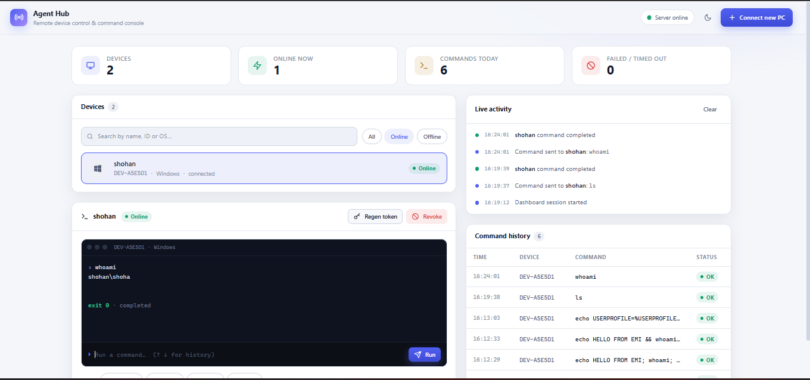
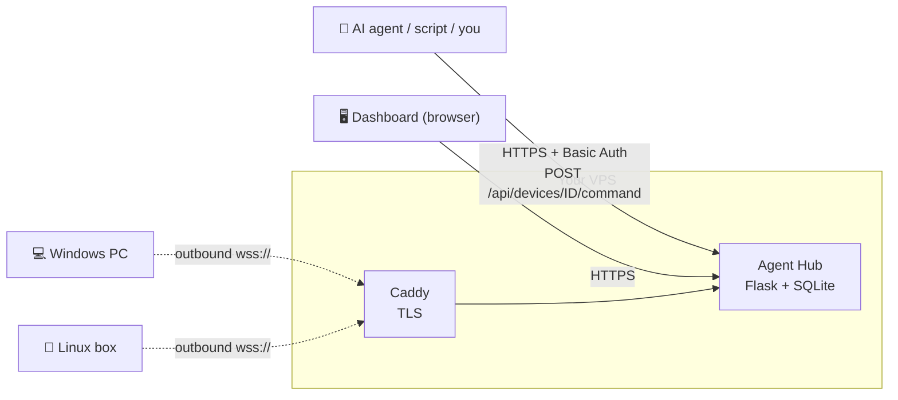
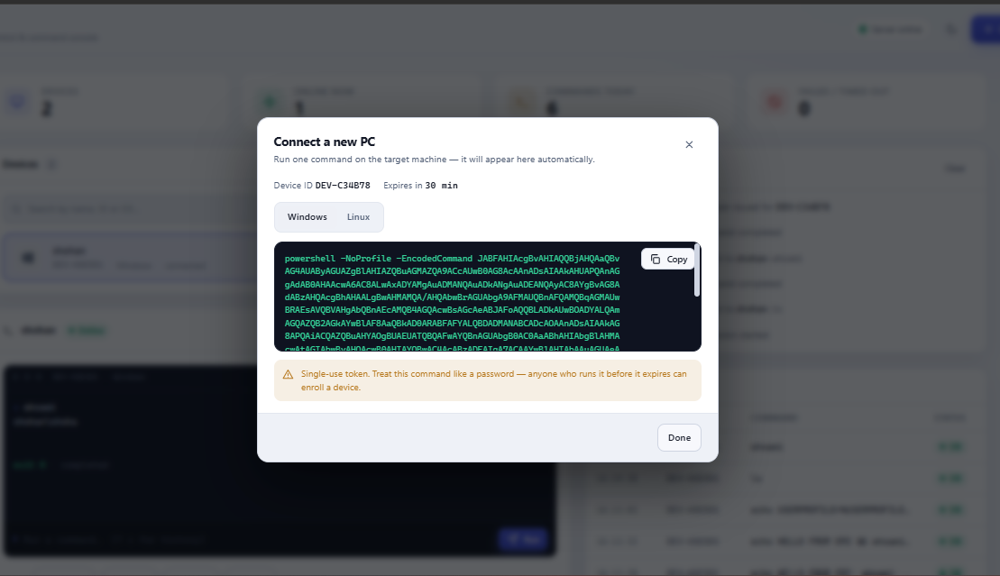

<div align="center">

# 🛰️ Agent Harness

### Give your AI agent hands on your own computers.

**A self-hosted remote command console and API that lets AI agents (Claude, GPT, local LLMs, your own scripts) run shell commands on your Windows and Linux PCs — with one-line enrollment, per-device credentials, a live dashboard, and instant revoke.**

> ### 🪟 No installer. No admin rights. No port forwarding. Just **one PowerShell command** on your PC.

[](https://www.python.org/)
[](#-connect-a-pc-in-one-line)
[](#-quick-start)
[](#-how-it-works)
[](LICENSE)

[Quick start](#-quick-start) · [Connect a PC](#-connect-a-pc-in-one-line) · [Use it with an AI agent](#-use-it-with-an-ai-agent) · [API](#-api-reference) · [Security](#-security-model--read-this-first) · [FAQ](#-faq)

<br>



</div>

---

<div align="center">

### ⚡ Connecting a PC takes one command

`+ Connect new PC` → `Copy` → paste in PowerShell → **online** ✅

[See how it works ↓](#-connect-a-pc-in-one-line)

</div>

---

## ✨ What is Agent Harness?

Most AI agents live in a chat window. **Agent Harness gives them a real machine to work on.**

You run a small server (the **Hub**) on any VPS or home server. You paste **one command** on a PC. That PC connects *outward* to your Hub and shows up in a clean dashboard. From then on, you — or your AI agent — can send commands to it and get back structured results: `stdout`, `stderr`, exit code, and timing.

It's built for people who want to:

- 🤖 **Let an LLM agent operate their own PCs** (build, test, deploy, inspect, fix) through a simple HTTP tool call.
- 🖥️ **Control several machines from one place** without VPNs, port forwarding, or SSH key juggling.
- 🧪 **Prototype agent infrastructure** with a small, readable codebase (Flask + SQLite + WebSocket) instead of a heavyweight platform.
- 📜 **Keep a record** of every command an agent ever ran.

> **Heads up:** this tool executes shell commands on enrolled machines — that's the whole point. Only enroll machines **you own or are authorized to administer**, and read the [security model](#-security-model--read-this-first) before exposing it to the internet.

---

## 🚀 Features

| | |
|---|---|
| ⚡ **One PowerShell command, no installer** | Click **Connect new PC**, copy one command, paste it on the target. No installer, no admin rights, no config files. |
| 🔐 **Single-use enrollment tokens** | Random, SHA-256 hashed at rest, expire in 30 minutes, and can only be redeemed once. |
| 🪪 **Per-device credentials** | Each PC gets its own permanent credential (hashed at rest) after enrolling. |
| 🛑 **Instant revoke** | One click disconnects a device and blocks it from reconnecting. |
| 🔄 **Regen token** | Re-enroll an existing device without creating a duplicate entry. |
| 📡 **Outbound-only from the PC** | Clients dial out over `wss://` — no inbound ports, no port forwarding, works behind NAT and firewalls. |
| 🧾 **Structured command protocol** | Every command gets a `request_id` and returns `status`, `exit_code`, `stdout`, `stderr`. |
| 🕒 **Full command history** | Every command and result is logged to SQLite and available via `/api/history`. |
| 🖥️ **Multi-device dashboard** | Search, filter Online/Offline, per-device terminal, live activity feed, light & dark themes. |
| ♻️ **Self-healing connections** | Clients auto-reconnect with exponential backoff and ping to detect dropped links. |
| 🪶 **Tiny footprint** | Server needs `flask` + `flask-sock`. Client needs `websocket-client`. That's it. |

---

## 🧠 How it works



1. **Hub** — a Flask app with a WebSocket endpoint, a SQLite database, and the dashboard. Bind it to localhost behind Caddy for TLS.
2. **Client** — one Python file (`client/harness_client.py`) that connects out to the Hub, authenticates, then waits for commands.
3. **Agent / you** — send a command to `/api/devices/<id>/command` (or type it into the dashboard terminal) and get the result back synchronously.

---

## ⚡ Quick start

**Requirements:** Python 3.9+ on the Hub, a VPS or server with a public IP, and [Caddy](https://caddyserver.com/) (recommended for HTTPS).

### 😎 The pro move: let your AI agent set it up

Hand the project to your coding agent (Claude Code, Cursor, Codex, anything with a terminal) and paste this:

```text
This is the agent-harness project. Set it up for me on this server:
1. Create a Python virtual environment (venv) inside the project and install requirements-server.txt into it. Never install system-wide.
2. Generate a long random dashboard password, save it somewhere safe, and export HARNESS_DASHBOARD_USER=admin and HARNESS_DASHBOARD_PASS.
3. Edit deploy/Caddyfile and replace YOUR_VPS_IP with this server's public IP.
4. Start server/app.py from the venv and run Caddy so the dashboard is reachable over https.
5. Tell me the dashboard URL, the username, and the password.
```

Your agent lives in the venv, your system stays clean, and you're connecting PCs in a couple of minutes. 🧑‍🍳

### 🔧 Manual setup

```bash
# 1. Get the code
git clone https://github.com/YOUR_USERNAME/agent-harness.git
cd agent-harness

# 2. Create a virtual environment and install server dependencies
python3 -m venv .venv
source .venv/bin/activate          # Windows: .venv\Scripts\activate
pip install -r requirements-server.txt

# 3. Set your dashboard login (use something long and random!)
export HARNESS_DASHBOARD_USER=admin
export HARNESS_DASHBOARD_PASS='change-me-to-something-long-and-random'

# 4. Start the Hub (binds to 127.0.0.1:8787, only the reverse proxy talks to it)
cd server
python3 app.py
```

Then, in a second terminal, put HTTPS in front of it:

```bash
# Edit deploy/Caddyfile and replace YOUR_VPS_IP with your server's public IP
sudo caddy run --config deploy/Caddyfile
```

Open `https://YOUR_VPS_IP` and log in. 🎉

> 💡 **No domain?** The included Caddyfile uses `tls internal` (a self-signed certificate) so you get `https://` and `wss://` on a bare IP. Traffic is fully encrypted; clients just skip certificate verification (already wired in). For CA-verified TLS, point a domain (even a free DuckDNS one) at your server, remove `tls internal`, and drop the `--insecure` flags.

<details>
<summary><b>No password set?</b></summary>

If `HARNESS_DASHBOARD_PASS` is missing, the Hub generates a random one and prints it to stderr on startup. Set the environment variable to make it permanent.

</details>

<details>
<summary><b>Quick local test without a reverse proxy (not for real use)</b></summary>

```bash
export HARNESS_BIND_PUBLIC=1
python3 server/app.py
```

This binds to `0.0.0.0:8787` with **no TLS** — your password and device credentials travel in plaintext. Local testing only.

</details>

---

## 🔌 Connect a PC in one line

<div align="center">

# 🪟 Paste one command. Your PC is online.

**No installer · No admin rights · No port forwarding · No config files**

<br>

| 1️⃣ Click | 2️⃣ Copy | 3️⃣ Paste |
|:---:|:---:|:---:|
| **+ Connect new PC** in the dashboard | Pick **Windows** or **Linux**, hit **Copy** | Run it in PowerShell (or a Linux terminal) |

<br>



</div>

<br>

That's the whole setup. The device shows up in the dashboard by itself, and from then on it reconnects on its own if the network drops.

**Windows (PowerShell)**

```powershell
powershell -NoProfile -EncodedCommand <generated for you by the dashboard>
```

**Linux**

```bash
curl -fsSLk "https://YOUR_VPS_IP/bootstrap.sh?token=...&device_id=..." | bash
```

> 🧠 You never write these by hand. The dashboard generates them with a fresh single-use token every time.

**What the one-liner does**

- **Windows** — runs a PowerShell `-EncodedCommand` that downloads the bootstrap with the built-in `curl.exe` (Windows 10 1803+ / 11), installs `websocket-client`, fetches the client, and starts it in the background.
- **Linux** — `curl … | bash` does the same: installs the dependency, downloads the client to `~/.local/share/agent-harness/`, and starts it with `nohup`.

**Requirements on the PC:** Python 3 on your `PATH` (the script handles the one pip dependency for you).

> 🔒 The enrollment command contains a single-use token. **Treat it like a password** until it's used or expires.

**Reconnecting later**

After the first run, the credential is cached in `~/.agent-harness/credential.json` (file mode `0600` on Linux). To start the client again without a new token:

```bash
python3 harness_client.py --server wss://YOUR_VPS_IP --insecure
```

Useful client flags: `--token` (register fresh, overrides any cache), `--reset` (wipe cached credential), `--insecure` (skip TLS verification for self-signed certs).

---

## 🤖 Use it with an AI agent

Any agent that can make an HTTP request can use Agent Harness. Here's a minimal Python tool you can plug into function calling / tool use with Claude, GPT, or a local model:

```python
import requests

HUB  = "https://YOUR_VPS_IP"
AUTH = ("admin", "your-dashboard-password")

def run_on_pc(device_id: str, command: str, timeout_s: int = 30) -> dict:
    """Run a shell command on an enrolled PC and return its result."""
    r = requests.post(
        f"{HUB}/api/devices/{device_id}/command",
        json={"command": command, "timeout_s": timeout_s},
        auth=AUTH,
        verify=False,            # self-signed cert; use a CA cert path in production
        timeout=timeout_s + 10,
    )
    return r.json()

print(run_on_pc("DEV-A5E5D1", "whoami"))
```

And the matching tool definition for your model:

```json
{
  "name": "run_on_pc",
  "description": "Run a shell command on one of the user's enrolled PCs and return stdout, stderr and exit code.",
  "input_schema": {
    "type": "object",
    "properties": {
      "device_id":  { "type": "string", "description": "Device ID, e.g. DEV-A5E5D1" },
      "command":    { "type": "string", "description": "Shell command to run" },
      "timeout_s":  { "type": "integer", "description": "Max seconds to wait", "default": 30 }
    },
    "required": ["device_id", "command"]
  }
}
```

> ⚠️ **Keep a human in the loop** until you trust your setup. There's currently no per-command allowlist or confirm-on-PC mode (see the [roadmap](#-roadmap)), so an agent can run anything the client's shell can run. Test on a throwaway VM first.

---

## 📚 API reference

All `/api/*` routes (except `/api/register`) require **HTTP Basic Auth** with your dashboard credentials.

| Method | Endpoint | What it does |
|---|---|---|
| `GET` | `/api/devices` | List devices with live `connected` status |
| `POST` | `/api/enroll` | Create a device + enrollment token; returns ready-to-paste Windows and Linux commands |
| `POST` | `/api/devices/<id>/reissue-token` | New enrollment token for an existing device |
| `POST` | `/api/devices/<id>/command` | Run a command and wait for the result |
| `POST` | `/api/devices/<id>/revoke` | Revoke the device and disconnect it |
| `GET` | `/api/history` | The 50 most recent commands with status and exit codes |
| `POST` | `/api/register` | *(used by the client)* Redeem an enrollment token for a credential |

**Run a command**

```bash
curl -k -u admin:YOUR_PASSWORD \
  -H "Content-Type: application/json" \
  -d '{"command": "echo hello from the harness", "timeout_s": 30}' \
  https://YOUR_VPS_IP/api/devices/DEV-A5E5D1/command
```

**Response**

```json
{
  "request_id": "cmd_9f3a21bc",
  "device_id": "DEV-A5E5D1",
  "status": "completed",
  "exit_code": 0,
  "stdout": "hello from the harness\n",
  "stderr": ""
}
```

Possible `status` values: `completed`, `timeout`, `error`. If the PC isn't connected you'll get `{"error": "device_offline"}`. Output is capped at 50,000 characters per stream.

---

## 🛡️ Security model — read this first

Agent Harness is **remote code execution by design**. Treat the Hub like the keys to every enrolled machine.

**What's built in**

- Enrollment tokens are random, hashed at rest, single-use, and expire after 30 minutes.
- Device credentials are random and hashed at rest; each device has its own, so revoking one doesn't affect the others.
- The dashboard and every control API are behind Basic Auth (constant-time comparison).
- PCs never accept inbound connections — they only dial out.
- The Hub binds to `127.0.0.1` by default; Caddy handles TLS.
- Every command and result is logged.

**Before you expose it publicly**

- ✅ Set a **long, random** `HARNESS_DASHBOARD_PASS`.
- ✅ Use a **real domain + CA certificate** if man-in-the-middle on first connect is in your threat model. The self-signed setup encrypts traffic but doesn't prove the Hub's identity.
- ✅ Restrict who can reach the dashboard (firewall, VPN, or IP allowlist in Caddy).
- ✅ Swap Flask's dev server for gunicorn (`gevent` worker) or similar before real use.
- ✅ **Revoke** devices you're done with.
- ⚠️ Don't enroll machines you don't own or have explicit permission to manage.

Found a vulnerability? Please open a private security advisory instead of a public issue.

---

## 🗂️ Project layout

```
agent-harness/
├── server/                 # Flask app, WebSocket endpoint, auth, commands, devices
├── client/
│   ├── harness_client.py   # Cross-platform client (the only thing PCs run)
│   ├── windows/bootstrap.ps1
│   └── linux/bootstrap.sh
├── web/templates/          # Agent Hub dashboard (dark/light)
├── database/schema.sql     # SQLite schema: devices, enrollment_tokens, commands
├── deploy/Caddyfile        # HTTPS reverse proxy config
├── docs/screenshots/       # Images used in this README
└── LICENSE
```

---

## ❓ FAQ

<details>
<summary><b>How is this different from SSH?</b></summary>

SSH needs inbound access to every machine (open ports, port forwarding, or a VPN) and key management per host. With Agent Harness the PCs connect *out* to your Hub, so it works from behind home routers and corporate NAT, and you get a single dashboard, a uniform JSON API for agents, and a built-in audit log.

</details>

<details>
<summary><b>Can I use it with Claude, ChatGPT, or a local model?</b></summary>

Yes. It's model-agnostic — anything that can call an HTTP endpoint (tool use, function calling, MCP wrapper, or a plain script) can drive it. See [Use it with an AI agent](#-use-it-with-an-ai-agent).

</details>

<details>
<summary><b>Do I need a domain name?</b></summary>

No. The default setup uses a self-signed certificate on your server's IP. A domain gives you a CA-trusted certificate and lets you remove the `--insecure` flag.

</details>

<details>
<summary><b>Does it work behind NAT or a firewall?</b></summary>

Yes — PCs only make outbound `wss://` connections on port 443.

</details>

<details>
<summary><b>Does the client survive a reboot?</b></summary>

Not yet. The bootstrap starts the client as a background process; after a restart, relaunch it with the cached credential (see [Reconnecting later](#-connect-a-pc-in-one-line)). Run-on-boot is on the roadmap.

</details>

<details>
<summary><b>What happens if I lose a laptop or want to cut a device off?</b></summary>

Click **Revoke** on that device. Its connection is closed immediately and its credential stops working.

</details>

<details>
<summary><b>The Windows one-liner failed — what now?</b></summary>

Make sure Python 3 is installed and on `PATH`, you're on Windows 10 1803+ or 11 (for `curl.exe`), and the token hasn't expired (30 min). If it has, press **Regen token** on the device and run the new command.

</details>

---

## 🗺️ Roadmap

- [ ] Per-command allowlist / deny-list policies
- [ ] Confirm-on-PC mode (approve risky commands locally)
- [ ] Run-on-boot service installers (systemd, Windows service/Task Scheduler)
- [ ] Multi-user dashboard login and API keys instead of one shared Basic Auth
- [ ] Production-grade server (gunicorn/ASGI) and Docker image
- [ ] Official MCP server wrapper
- [ ] File upload/download
- [ ] macOS client

Have an idea? [Open an issue](https://github.com/YOUR_USERNAME/agent-harness/issues) — contributions are welcome.

---

## 🤝 Contributing

1. Fork the repo and create a branch.
2. Keep changes small and focused.
3. Open a pull request describing what changed and how you tested it.

---

## 📄 License

MIT — see [LICENSE](LICENSE).

---

<div align="center">

**If Agent Harness is useful to you, a ⭐ helps other people find it.**

<sub>Self-hosted remote command console · AI agent remote execution · remote shell API for LLM agents · Windows & Linux · Flask · WebSocket · SQLite</sub>

</div>
